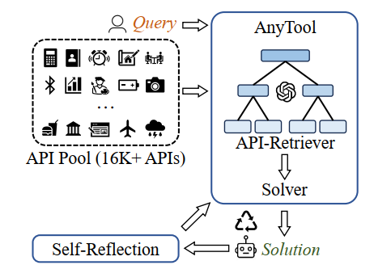

# AnyTool

<a href='https://arxiv.org/abs/2402.04253'></a>  <a href='https://github.com/dyabel/AnyTool/blob/public/LICENSE'></a>

This is the implementation of the paper [AnyTool: Self-Reflective, Hierarchical Agents for Large-Scale API Calls](https://arxiv.org/abs/2402.04253)


# 🔧 Installation
## ✅ Dependencies
Require Python 3.9+

## 🚀 Quick install 
```bash
pip install -r requirements.txt
```

# 🔆 Preparation

**OPENAI API config and the ToolBench key**

Fill your OpenAI GPT-4 API config and toolbench key into the config.py (see config_example.py). 

Fill out the [form](https://docs.google.com/forms/d/e/1FAIpQLSdqHypmYanWU8ZhuUcrEuM5eFB03WqaqYJzvKUxUe1HzUBB3A/viewform?usp=send_form) to get the toolbench key. 

**ToolBench**

Download the ToolBench data using the following link: [Google Drive](https://drive.google.com/drive/folders/1yBUQ732mPu-KclJnuQELEhtKakdXFc3J) or [Tsinghua Cloud](https://cloud.tsinghua.edu.cn/f/c9e50625743b40bfbe10/).

The file structure is as follows:
```
├── /data/
│  ├── /instruction/
│  ├── /answer/
│  ├── /toolenv/
│  ├── /retrieval/
│  ├── /test_instruction/
│  ├── /test_query_ids/
│  ├── /retrieval_test_query_ids/
│  ├── toolllama_G123_dfs_train.json
│  └── toolllama_G123_dfs_eval.json
├── /reproduction_data/
│  ├── /chatgpt_cot/
│  ├── /chatgpt_dfs/
│  ├── ...
│  └── /toolllama_dfs/
```

For more details, please refer to [ToolBench](https://github.com/OpenBMB/ToolBench).

**Prepare the API data**

You should prepare the ToolBench data first. Make sure you have the directory of data/toolenv/tools
```
export PYTHONPATH=./
python scripts/extract_api_details.py
python scripts/extract_category_tool_details.py
python scripts/extract_tool_database.py
```

**AnyToolBench**

Generation script
```
export PYTHONPATH=./
python scripts/anytoolbench_generation.py --output_path atb_data/anytoolbench_new.json
```

We provide sample data in [anytoolbench.json](./atb_data/anytoolbench.json) file.


# 🚗 Run AnyTool
Fill your OpenAI GPT API config and toolbench key into the config.py (see config_example.py). We use Azure OpenAI for all our experiments. You can modify it according to your own configuration. 

Experiment on ToolBench, take G1-I as an example.
```
export PYTHONPATH=./
python scripts/main.py --output_dir result/test_instruction/G1_instruction --query_path data/test_instruction/G1_instruction.json --max_api_number 64
```
Experiment on AnyToolBench
```
export PYTHONPATH=./
python scripts/main.py --output_dir result/anytoolbench --query_path anytoolbench.json -max_api_number 64
```

# 👨‍🏫 Acknowledgement
This repo is built on [ToolBench](https://github.com/OpenBMB/ToolBench).

# 📑Citation
If you find this project is helpful for your research, consider citing our paper
```
@article{du2024anytool,
  title={AnyTool: Self-Reflective, Hierarchical Agents for Large-Scale API Calls},
  author={Du, Yu and Wei, Fangyun and Zhang, Hongyang},
  journal={arXiv preprint arXiv:2402.04253},
  year={2024}
}
```
